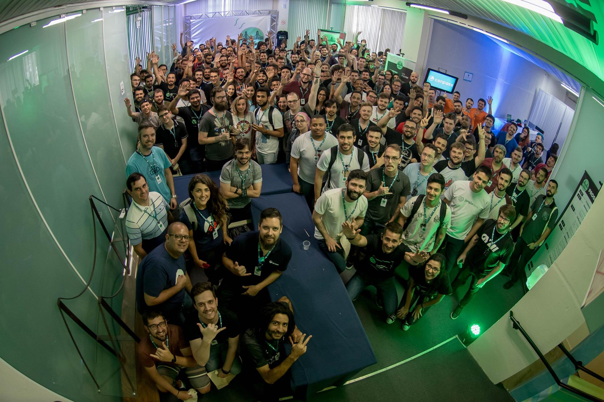

# 2018

## [GDG Divinópolis](https://www.meetup.com/pt-BR/GDG-Divinopolis/)

### Meetup 6 - React com next.js & falhas de segurança em aplicativos

[code code](https://github.com/wharley/meetup-GDG)

__Local:__ UEMG - Av. Paraná, 3001 - Jardim Belvedere, Divinópolis - MG, 35501-170

__Palestra:__ Começando a trabalhar com react utilizando next.js

__Data:__ 15-12-2018

__Horário:__ 09:00 até 11:00

__Slides:__
<iframe src="https://docs.google.com/presentation/d/e/2PACX-1vRwx5xnpDZO5HI1jWyQ3oag_5X5noEA7vfLgfzs7dXOjZ2zCntAVXyGs-c6Rh1g1y_6nFKRnJy8yotY/embed?start=false&loop=false&delayms=3000" frameborder="0" width="960" height="569" allowfullscreen="true" mozallowfullscreen="true" webkitallowfullscreen="true"></iframe>

---

## [Impulso Network](https://impulso.network/)

### Meetup Bar - Planejamento de carreira

__Local:__ Online

__Palestra:__ Bate papo sobre planejamento de carreira e como podemos aplicar metodologias empregadas em desenvolvimento de software e negócios para alavancar sua vida profissional

__Data:__ 12-12-2018

__Horário:__ 20:00

---

## [Frontin Floripa](http://frontinfloripa.com.br/)

### Maior evento front-end de Santa Catarina

__Local:__ Rodovia João Paulo, 2285, Bairro João Paulo, Florianópolis - SC - Brasil

__Palestra:__ A saga de um DEV - Tudo é possível

__Data:__ 01-12-2018

__Horário:__ 08:00 até 18:15

__Slides:__
<iframe src="https://docs.google.com/presentation/d/e/2PACX-1vSgUk8f0XRLYZIQUWEOHfHaGKRUVa3V-vehBratelsdnoU7C5Vh0XRV4WiaHEsxSJvRZWNjAiiAXPZR/embed?start=false&loop=false&delayms=3000" frameborder="0" width="960" height="569" allowfullscreen="true" mozallowfullscreen="true" webkitallowfullscreen="true"></iframe>

---

## [Trainning Center](https://www.meetup.com/pt-BR/Training-Center-BH/)

### Meetup 2

__Local:__ R. Cláudio Manoel, 36 - Funcionários, Belo Horizonte - MG, 30140-100

__Palestra:__ Introdução ao framework Next.js

__Data:__ 19-04-2018

__Horário:__ 19:00

__Slides:__
<iframe src="https://docs.google.com/presentation/d/e/2PACX-1vSZJwDE65jGij4ajwLwBvnjy97wvV2GEGBs-4-cXF-l_I-Vc1pQ_x9CizN0s8kkuAZoWPc0yogjrUKc/embed?start=false&loop=false&delayms=3000" frameborder="0" width="960" height="569" allowfullscreen="true" mozallowfullscreen="true" webkitallowfullscreen="true"></iframe>