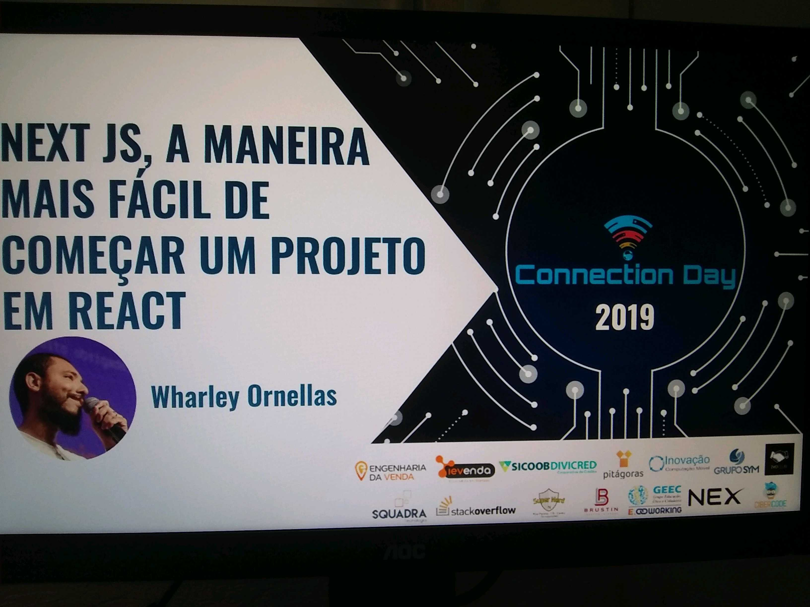
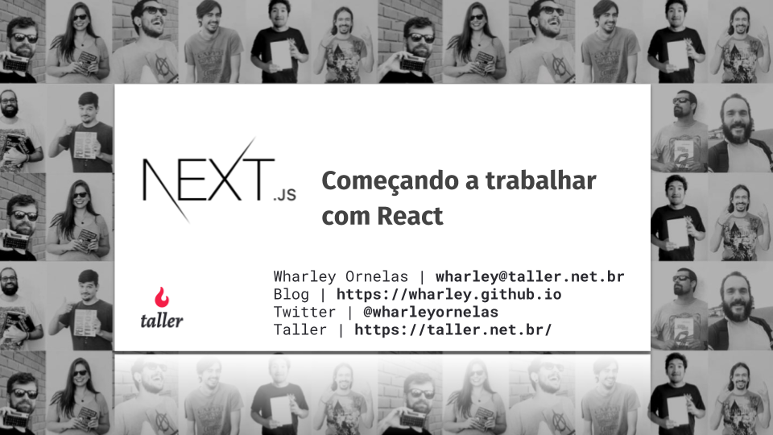

# 2019

## [Front In Sampa](https://www.frontinsampa.com.br/)

### Front In Sampa

__Local:__ Centro de Convenções Rebouças - SP

__Palestra:__ Nextjs - A maneira mais fácil de começar um projeto em Reactjs

__Data:__ 13-07-2019

__Horário:__ 08:00 até 18:00

__Slides:__

---

## [Braziljs on the road Sorocaba](https://braziljs.org/eventos/otr-sorocaba/2019/)

### Braziljs on the road Sorocaba

__Local:__ Parque Tecnológico de Sorocaba - Av. Itavuvu, 11777 - Jardim Santa Cecilia, Sorocaba - SP

__Palestra:__ A saga de um dev. Tudo é possível

__Data:__ 15-06-2019

__Horário:__ 08:20 até 18:20

__Slides:__

---

## [Femug MG](https://www.meetup.com/en-AU/FEMUG-MG/events/261430900/)

### Femug - 4 Femug 2019 de Minas Gerais

[code code](https://github.com/wharley/femug)

__Local:__ Hubble Hub - Ru da Bahia, 1600 - Centro, Belo Horizonte - MG

__Palestra:__ Nuxtjs - A maneira mais fácil de criar um projeto SSR

__Data:__ 22-05-2019

__Horário:__ 19:00 até 21:00

__Slides:__

---

## [Connection Day](https://connectionday.tech/)

### Connection Day - O maior evento de tecnologia do centro-oeste mineiro

[code code](https://github.com/wharley/connection-day)

__Local:__ Pitágoras - Rua Santos Dumont, 1001 Bairro Manoel Valinhas, Divinópolis - MG

__Palestra:__ Nextjs - A maneira mais fácil de começar um projeto em Reactjs

__Data:__ 04-05-2019

__Horário:__ 08:00 até 18:00

__Slides:__

---

# 2018

## [GDG Divinópolis](https://www.meetup.com/pt-BR/GDG-Divinopolis/)

### Meetup 6 - React com next.js & falhas de segurança em aplicativos

[code code](https://github.com/wharley/meetup-GDG)

__Local:__ UEMG - Av. Paraná, 3001 - Jardim Belvedere, Divinópolis - MG, 35501-170

__Palestra:__ Começando a trabalhar com react utilizando next.js

__Data:__ 15-12-2018

__Horário:__ 09:00 até 11:00

__Slides:__

---

## [Impulso Network](https://impulso.network/)

### Meetup Bar - Planejamento de carreira

__Local:__ Online

__Palestra:__ Bate papo sobre planejamento de carreira e como podemos aplicar metodologias empregadas em desenvolvimento de software e negócios para alavancar sua vida profissional

__Data:__ 12-12-2018

__Horário:__ 20:00

---

## [Frontin Floripa](http://frontinfloripa.com.br/)

### Maior evento front-end de Santa Catarina

__Local:__ Rodovia João Paulo, 2285, Bairro João Paulo, Florianópolis - SC - Brasil

__Palestra:__ A saga de um DEV - Tudo é possível

__Data:__ 01-12-2018

__Horário:__ 08:00 até 18:15

__Slides:__

---

## [Trainning Center](https://www.meetup.com/pt-BR/Training-Center-BH/)

### Meetup 2

__Local:__ R. Cláudio Manoel, 36 - Funcionários, Belo Horizonte - MG, 30140-100

__Palestra:__ Introdução ao framework Next.js

__Data:__ 19-04-2018

__Horário:__ 19:00

__Slides:__

---

# 2017

## [Frontinbh](https://frontinbh.com.br/)

### 6º edição do FrontInBH - Maior evento de Front-end do Brasil.

__Local:__ Teatro Ney Soares - Rua Diamantina, 463 Belo Horizonte . MG

__Palestra:__ A saga de um DEV - Tudo é possível

__Data:__ 23-09-2017

__Horário:__ 08:00 até 18:00

---

## [Nodeschool & Nodegirls](https://www.meetup.com/pt-BR/NodeBR-Minas-Gerais/events/240393518/)

__Local:__ Guaja - Av. Afonso Pena 2881 · Belo Horizonte

__Data:__ 10-06-2017

__Horário:__ 09:00 até 18:00

---

## [Meetup Node JS](https://www.meetup.com/pt-BR/NodeBR-Minas-Gerais/events/239121660/)

### Meetup Node JS - 8ª edição

__Local:__ Concrete Solutions - Av. Getúlio Vargas, 671 Sala 800 - 8º andar · Belo Horizonte

__Palestra:__ Orm sequelize com bancos relacionais no ecosistema nodejs

__Data:__ 18-09-2017

__Horário:__ 19:00 até 22:00

__Slides:__

